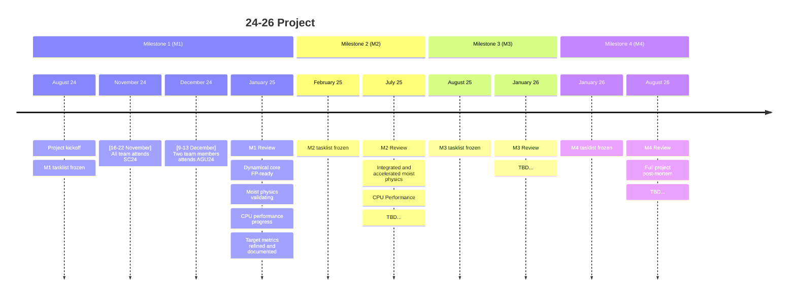

# 2024 - 2026: Proving NDSL for GEOS

The Software Modernization team proposes a two-year plan to prove the [NDSL](https://github.com/NOAA-GFDL/NDSL) technology at scale on NASA's [GEOS](https://github.com/GEOS-ESM/GEOSgcm) flagship model. The timeline of the project goes as follows:

Kanban board and full project breakdown [available on Github project](https://github.com/orgs/GEOS-ESM/projects/11/views/9).

Any questions please email: <florian.g.deconinck@nasa.gov>

The work is divided in 4 6-months milestone. As part of Milestone 1 (M1) the team as defined [science targets](./science-targets.md) and [HPC metrics](./hpc-metrics.md) that'll be reviewed for each benchmark.

## Publicly presented results

- [Supercomputing 23](https://github.com/GEOS-ESM/SMT-Nebulae/wiki/2426-results-SC23) (November 2023)

## Relevant previous and surrounding work

- Validation and benchmark of the [Pace](../satellite-work/pace.md) model, seeding project to the 24-26 project at NASA
