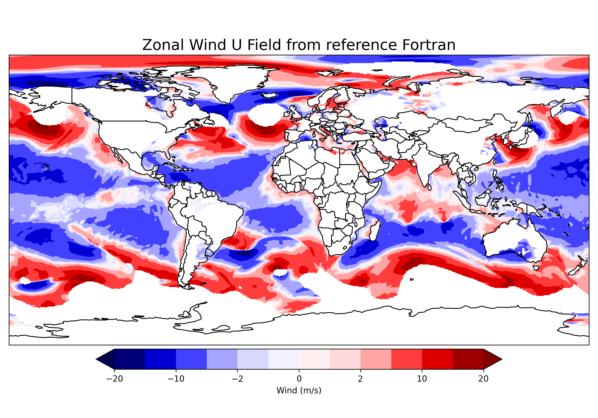
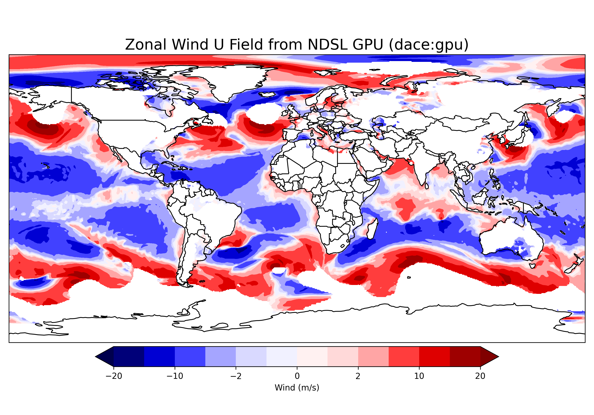
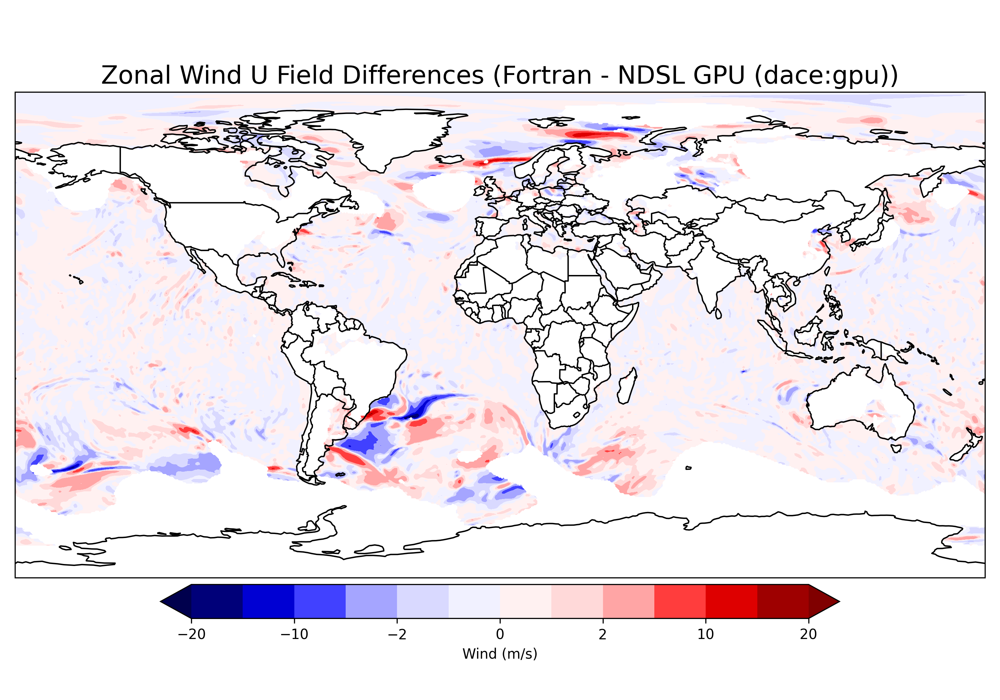

# Early Microphysics results (March)

!!! abstract ""
    [Back to M2 results summary](summary.md)

Project call for the porting of the [GFDL One Moment Microphysics (GFDL_1M)](../../../GEOS/components/moist/GFDL_1M.md). The work was concluded in March with validation on performance backends and early pre-optimization benchmarks

## Validation

!!! example "Hardware & software stack"
    Validation using the [Discover hardware](./summary.md#hardware)

Validation was done on a GEOS-FP run at [C180-L137](https://geos-esm.github.io/SMT-Nebulae/GEOS/) (~51 km horizontal resolution) over 7 days of simulated time. Only the GFDL Microphysics scheme was swapped from Fortran to NDSL, the rest of the model code is running the original Fortran.

Below are the distribution of differences between the reference Fortran and the GPU performance backend after 7 days of simulation.

_Note_: validation was done on CPU performance backend first but isn't shown here because the results are similar

We start with an histogram showing the repartition of differences between the reference Fortran. We have good agreement with a few outliers:

Looking at the zonal wind in particular to explore the outliers, we show below the reference Fortran and the NDSL performance backend:

The above graphs show differences around storm regions (Brazil). Those differences are on the position of the front leading to large value differences. Below we graph the difference between Fortran and NDSL to show a good spatial agreement of the runs:

### Benchmark

Benchmark is done by measuring CPU time (post sync for GPU) at the Fortran level (overhead of going to GPU from CPU is included in the number). This mirrors the real life application of the technology running an "hybrid" GEOS.

Time are given in seconds. Positive speed up means NDSL is faster, negative means original Fortran is faster.

| Resolution   | Layout | Fortran | NDSL GPU (dace:gpu) | NDSL CPU (gt:cpu_kfirst) | Speed up CPU/GPU | Speed up CPU/CPU |
| ----------   | ------ | ------- | ------------------- | ------------------------ | ---------------- | ---------------- |
| C180 (~51km) | 4x4    | 0.23s   | 0.04s               | 0.37s                    | 6.29x            | -1.62x           |
