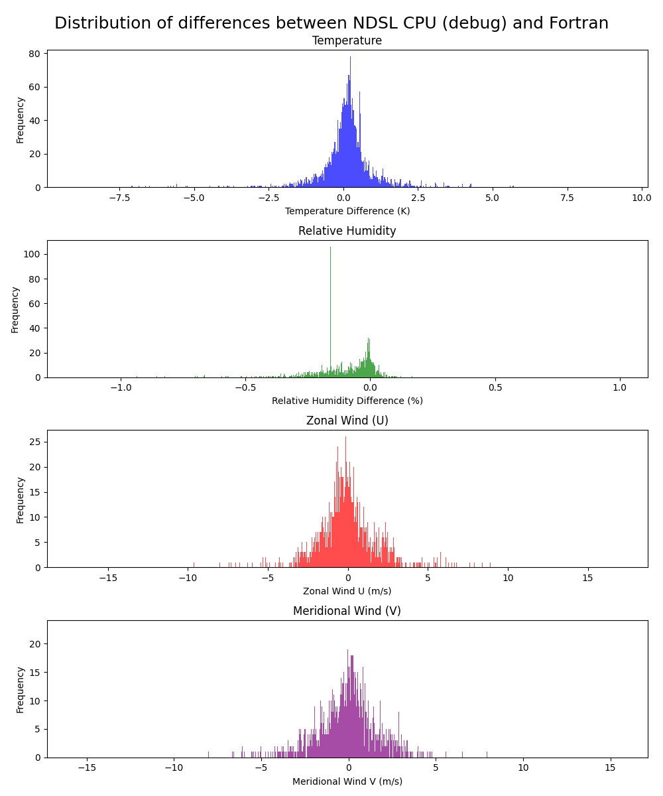
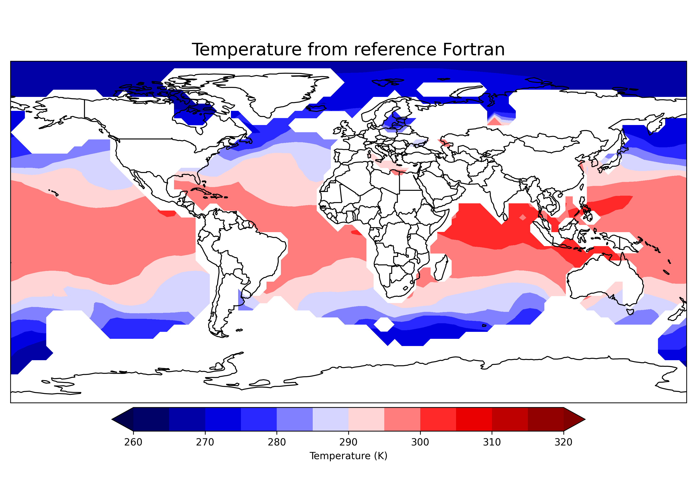
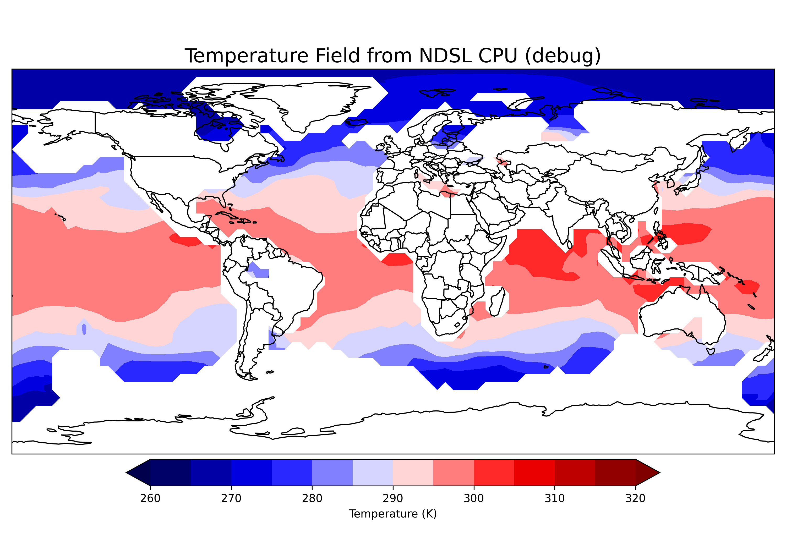
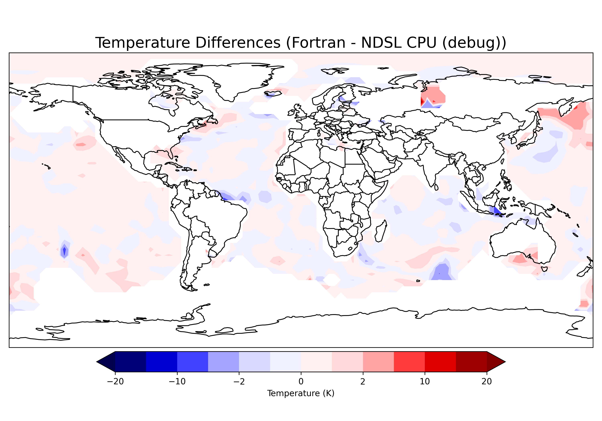

# Early UW Shallow Convection results (May)

!!! abstract ""
    [Back to M2 results summary](summary.md)

Project call for the porting of the [UW Shallow Convection scheme (UW)](../../../GEOS/components/moist/UW.md). The work was concluded in May with validation on performance backends and early pre-optimization benchmarks.

## Validation

!!! example "Hardware & software stack"
    Validation using the [Discover hardware](./summary.md#hardware)

Validation was done on a GEOS-FP run at [C180-L137](https://geos-esm.github.io/SMT-Nebulae/GEOS/) (~51 km horizontal resolution) [<--is this correct?] over 7 days of simulated time. Only the UW Shallow Convection scheme was swapped from Fortran to NDSL, the rest of the model code is running the original Fortran.

Below are the distribution of differences between the reference Fortran and the CPU performance backend after 7 days of simulation.

We start with an histogram showing the distribution of differences between the reference Fortran. While a good portion of the differences are centered around zero,
there are still a larger number of non-zero outliers. especially for relative humidity and wind. These outliers could be due to numerical differences that still exist in the UW shallow convection scheme between the Fortran and Python. Though these errors are relatively small, they can become quite large over a 7 day simulation:

Looking at temperature in particular to explore the outliers, we show below the reference Fortran and the NDSL performance backend:

The temperature patterns look very similar between the Fortran and Python. However some large differences exist in places where the temperature gradient is slightly misplaced in the Python. Below we graph the difference between Fortran and NDSL to show a good spatial agreement of the runs:

### Benchmark

Benchmark is done by measuring CPU time (post sync for GPU) at the Fortran level (overhead of going to GPU from CPU is included in the number). This mirrors the real life application of the technology running an "hybrid" GEOS.

Time are given in seconds. Positive speed up means NDSL is faster, negative means original Fortran is faster.

** Still need to do UW runs on C180**

| Resolution   | Layout | Fortran | NDSL GPU (dace:gpu) | NDSL CPU (gt:cpu_kfirst) | Speed up CPU/GPU | Speed up CPU/CPU |
| ----------   | ------ | ------- | ------------------- | ------------------------ | ---------------- | ---------------- |
| C180 (~51km) | 4x4    | 0.XXs   | 0.XXs               | 0.XXs                    | X.XXx            | -X.XXx           |
