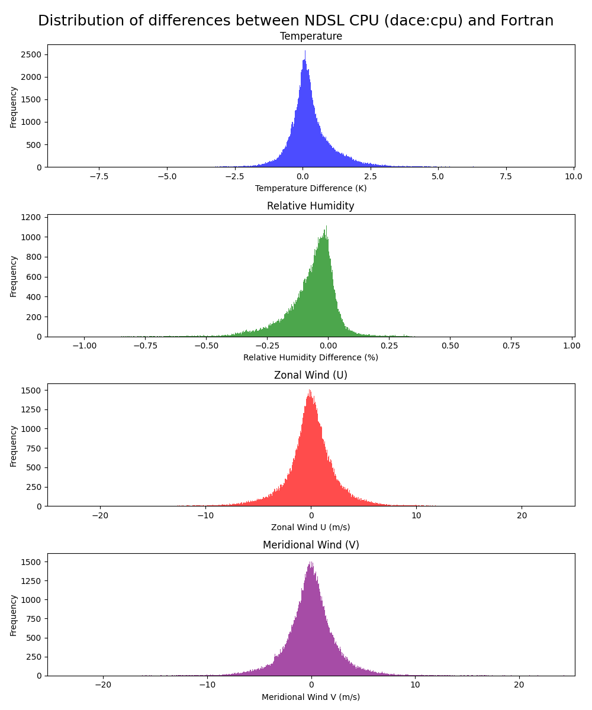
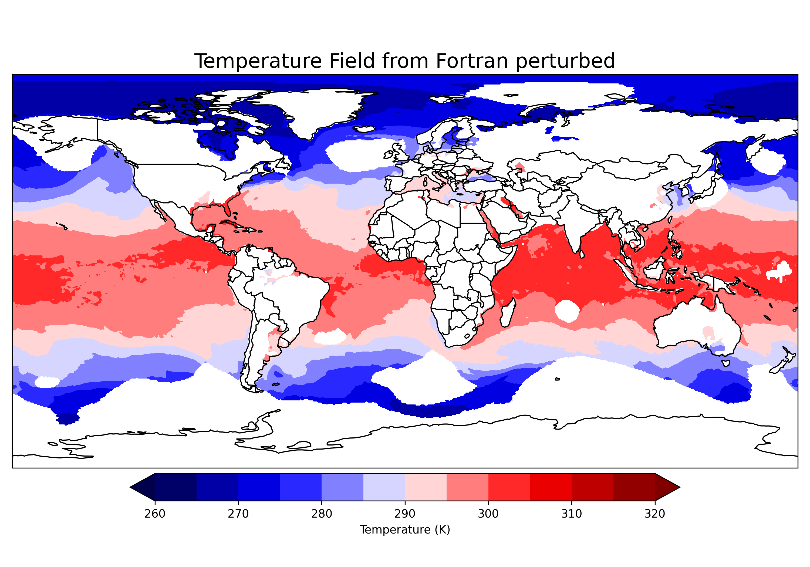
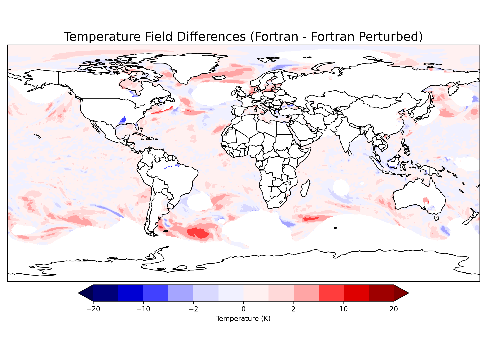
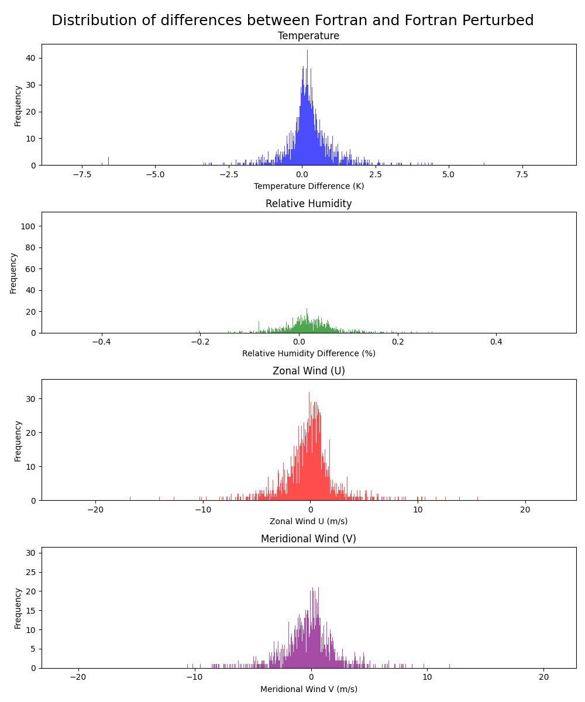

# Early UW Shallow Convection results (August)

!!! abstract ""
    [Back to M2 results summary](summary.md)

Project call for the porting of the [UW Shallow Convection scheme (UW)](../../../GEOS/components/moist/UW.md). The work was concluded in August with validation on performance backends and early pre-optimization benchmarks.

## Validation

!!! example "Hardware & software stack"
    Validation using the [Discover hardware](./summary.md#hardware)

Validation was done on a GEOS-FP run at [C180-L137](https://geos-esm.github.io/SMT-Nebulae/GEOS/) (~51 km horizontal resolution) over 7 days of simulated time. Only the UW Shallow Convection scheme was swapped from Fortran to NDSL, the rest of the model code is running the original Fortran.

Below are the distribution of differences between the reference Fortran and the CPU performance backend after 7 days of simulation.

We start with an histogram showing the distribution of differences between the reference Fortran. While a good portion of the differences are centered around zero,
there are still a larger number of non-zero outliers. especially for relative humidity and wind. These outliers are most likely due to numerical differences that still exist between the Fortran and NDSL in the UW shallow convection scheme. Alhough these errors are relatively small, they can become quite large over a 7 day simulation:

Looking at temperature in particular to explore the outliers, we show below the reference Fortran and the NDSL performance backend:

The temperature patterns look very similar between the Fortran and Python. However some differences do exist at places where the temperature gradient is slightly misplaced in the NDSL. Below we graph the difference between Fortran and NDSL to show generally good spatial agreement of the runs, however some large errors do exist at several places. Again, these errors are most likely due to the numerical differences that still exist between the Fortan and the NDSL in the UW shallow convection scheme:

### Benchmark

Benchmarking in progress...

## Perturbed initial condition Fortran runs
To demonstrate how small errors can grow into larger errors throughout a 7-day Fortran simulation, we experimented by applying small perturbations to several UW inputs (e.g., T, Q, U, V) at initialization. We then ran the model for 7 days. The differences (Fortran - Fortran Perturbed) after the 7 day run are shown below:

Looking at temperature again, here are temperature fields for the Fortran and the perturbed Fortran runs: 

And the temperature differences between the reference Fortran and the perturbed Fortran runs:

![Temperature (K) [Fortran - Perturbed Fortran]](../img/T_diff_world_perturb.png)

It can be seen that by initializing the Fortran run with relatively small errors, those errors can become exacerbated over time and grow into much larger errors. Therefore, even though we have achieved very close numerical validation of the UW shallow convection scheme, the small errors that still exist between the Fortran and NDSL have the potential to grow into large errors throughout a longer simulation. Going forward, we plan to pay close attention to these errors and try to minimize them as best we can.