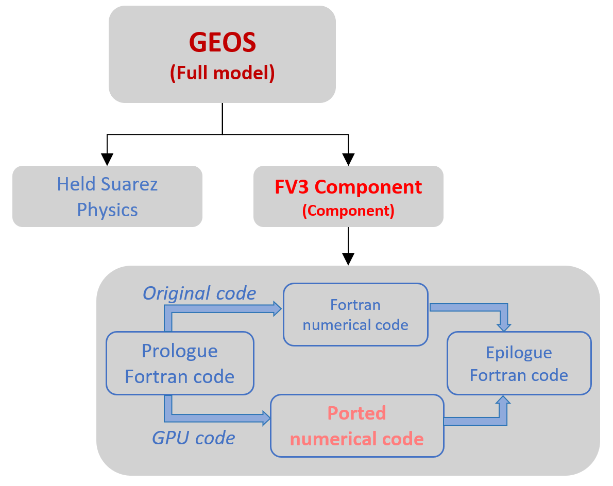
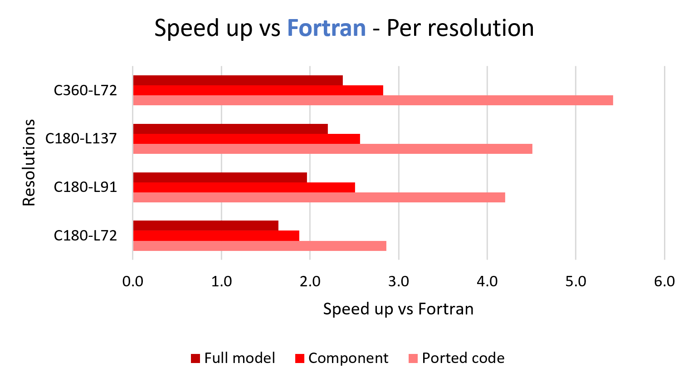
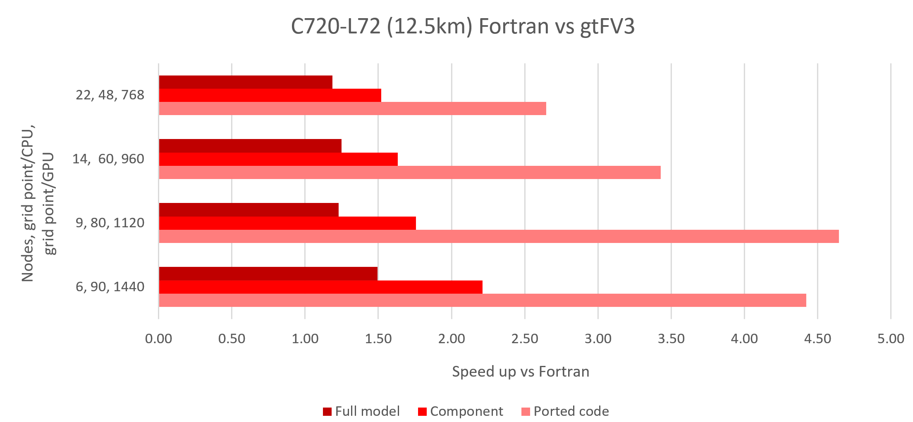
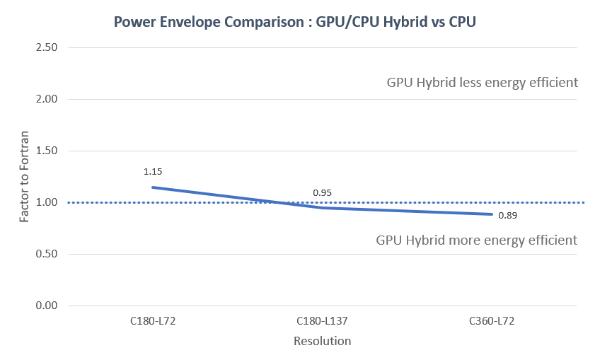
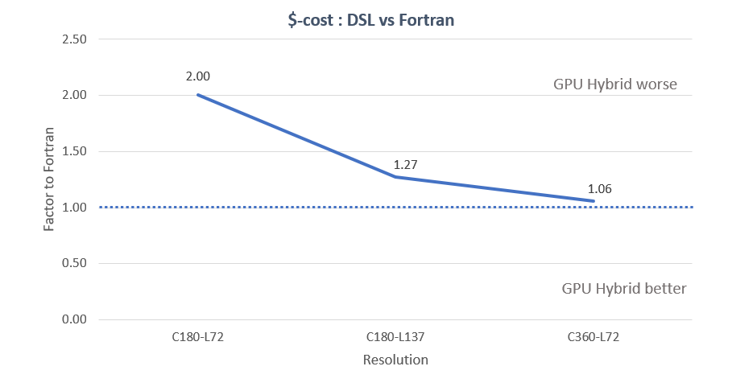

# Supercomputing 23 results

Those results where presented at [SC23](https://sc23.supercomputing.org/) and represent the state of the work at that date (November 2023).

## Node-to-node benchmarks

The benchmark were conducted on the Dynamical Core, on an Held-Suarez and Aquaplanet application of [GEOS](https://gmao.gsfc.nasa.gov/GEOS_systems/). We measured the performance at multiple points in the code to show the results of integration when looking at:

- directly ported code (including Fortran <-> Python transfers)
- component level
- model level

All results are given in speed up for a "note to node" setup, e.g. a CPU-only node is compared to a CPU-GPU fat node.

On [Discover](https://www.nccs.nasa.gov/systems/discover), we ran resolution benchmarks with hardware setup as follows:

- 2 nodes – with Dual HDR Infiniband 2x200 Gbps
- 8x A100 GPUs – 40 GB (released 2021)
- 4x EPYC 7402 – 96 cores (released 2020)

On [Perlmutter](https://perlmutter.carrd.co), we ran scaling benchmarks for C720-L72 resolution with hardware setup as follows:

- Slingshot 11 interconnect
- 4x A100 GPUs – 40 GB (released 2021)
- 1x EPYC 7763 – 64 cores (released 2022)

## Other metrics

We ran a power-envelop comparison. This was done using software level sampling of the power usage, therefore the precision of the numbers is average. The following results should be taken as an indication of the magnitude of the difference rather than a precise measurement.

- Setup : 24h simulation of GEOS Held-Suarez

Another metric is a cost-comparison when taking into account the speed up between CPU and GPU. GPU cost varies wildly, again this should be taken as an indication of the magnitude of the difference rather than a precise measurement.

- Based on NCCS’s Discover SC16 GPU partition.
- Measures the median dynamical core call
- To break even in cost, we need at least 5.5x improvement in performance on this setup

