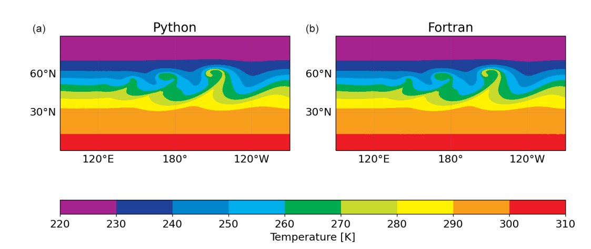
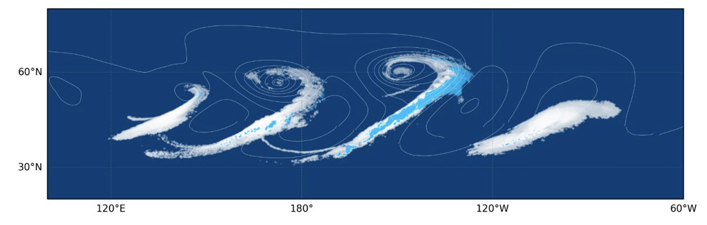
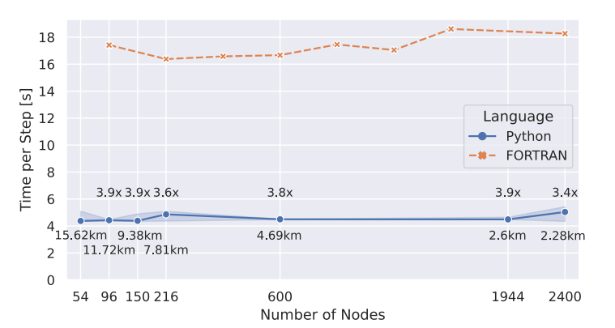
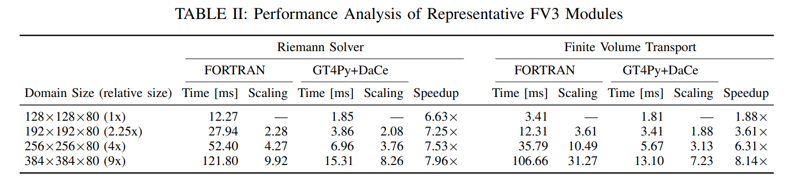

# Pace

Funded by Vulcan and [AI2](https://allenai.org/)[^1], the Pace model was a pure python model based on the [GT4Py DSL](https://gridtools.github.io/gt4py/latest/index.html) combined with leveraging [DaCe](https://spcl.inf.ethz.ch/Research/DAPP/) for full program optimization. The model is a port combining the [FV3](https://www.gfdl.noaa.gov/fv3/) Dynamical Core and the microphysics of [NOAA's GFDL](https://www.gfdl.noaa.gov/). The two papers published on it are:

- Dahm, Johann et al. “Pace v0.2: a Python-based performance-portable atmospheric model.” Geoscientific Model Development (2023): n. pag. [PDF](https://pdfs.semanticscholar.org/595b/3baa094c347b8c624d485811d72d029f5738.pdf)
- Ben-Nun, Tal et al. “Productive Performance Engineering for Weather and Climate Modeling with Python.” SC22: International Conference for High Performance Computing, Networking, Storage and Analysis (2022): 1-14. [PDF](https://arxiv.org/pdf/2205.04148)

Below we summarize the findings. For more figures and in-depth explanation read the papers.

## Validation

The model ran for an idealistic baroclinic wave for 9 days at 1.8km average horizontal resolution.
Validation of the model code was done numerically section by section first and was followed up with a scientifically relevant diagnostics.

Here the temperature at 850mb for the reference Fortran model and Pace:

The 9 days simulation was stable and produced rain as expected. Below is a plot of rain, cloud cover and pressure gradients after 9 days.

## Benchmark

The 9 days simulation presented above was computed on the 4056 nodes of the [Piz Daint supercomputer](https://www.cscs.ch/computers/piz-daint) with 4056 P100 Nvidia GPUs. The throughput was **0.11 SYPD** or **40.15 SDPD**.

More complete figures for benchmarking on smaller runs are shown below.

_Comparison of CPU-Fortran run vs GPU-Python runs relative to node scaling_

_Performance analysis of representative FV3 (dynamical core) modules_

[^1]: Results presented here by a co-authors of the quoted papers
