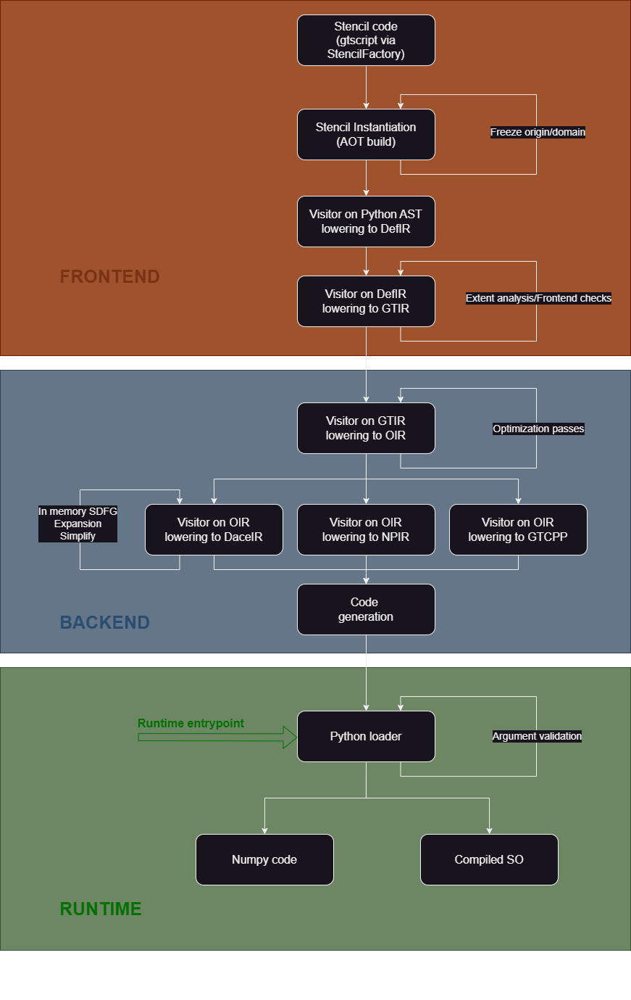
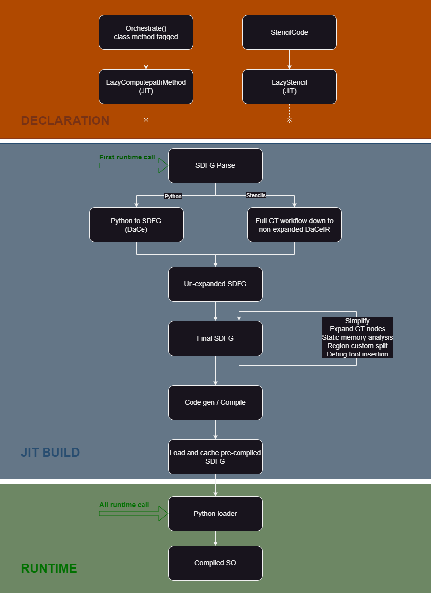

# Backend overview

Backend work is split into multiple repositories, each having their quirks to work with. In particular,

- [NDSL](./repositories/ndsl.md) - Pulls everything together and exposes "the DSL". In particular, orchestration code lives in this repository.
- [GT4Py](./repositories/gt4py.md) - The component that defines the frontend, has all the intermediate representations (IR) and dispatches to multiple backends.
- [DaCe](./repositories/dace.md) - Data-driven optimization framework used in GT4Py as performance backend. Full program optimizer driving orchestration.

## Backend workflows

There's two main workflows for the backend depending on which part model code is targeted for transpiling. The backend can either work

- on a stencil level, known as GridTools or `stencil workflow`
- or on the full program, known as `orchestration workflow`.

The `orchestration workflow` _wraps_ the `stencil workflow` and extends transpiling to the python code in-between the stencils. This allows for more analysis (e.g. in the DaCe backends) and lowers that launch overhead for (small) stencils.

_Stencil workflow diagram_

_Orchestration workflow diagram_

## GT4Py / DaCe bridge

DaCe provides two high-performance backends in the GT4Py backend; one for CPU, and one for GPU. The code that "converts" GT4Py's "Optimization IR" (OIR) to DaCe SDFGs is commonly know as "the bridge", see [GT4Py/Dace bridge](./dace-bridge.md).

## Schedule tree

The schedule tree is the code representation used to do macro-level optimization like loop re-ordering and merging. Further reading:

- [current state of the feature](./schedule-tree.md)
- choice of [representation](./ADRs/stree.md)
- choice of [DaCe version](./ADRs/stree_dace-version.md) to work against (for the first version)
- choice of [integration point](./ADRs/stree_ndsl-integration.md) (for the first version)
