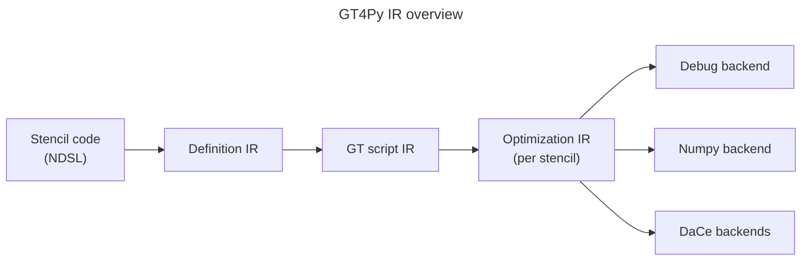
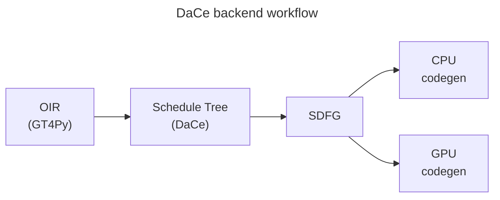

# Backend overview

NDSL has multiple backends, each serving different purposes:

- Debug backend: easy to read python code. Playground for new DSL features. Really, really slow.
- Numpy backend: "fast" python-based backend. Playground for new science code.
- DaCe backends: performance backends for running at scale in production. Has the ability to optimize code in between stencils, see [orchestration](./orchestration.md).

Note: DaCe backends is plural because that backend can either generate code that targets CPUs or GPUs.

## DaCe backend details

The DaCe backend workflow cleanly separates scheduling choices (i.e. macro-level optimizations like loop order, kernel merges, ...) from DaCe dataflow optimization.

All scheduling choices happen in the schedule tree. After the schedule is fixed, we create a Stateful Dataflow multiGraphs (SDFG), DaCe's representation for data-driven optimizations. Code generation (to multiple targets) follows from the SDFG.

### Schedule tree

- [current state of the feature](./schedule-tree.md)
- choice of [representation](./ADRs/stree.md)
- choice of [DaCe version](./ADRs/stree_dace-version.md) to work against (for the first version)
- choice of [integration point](./ADRs/stree_ndsl-integration.md) (for the first version)

### Orchestration

DaCe backends can either optimize per-stencil or do whole program optimization through orchestration. Orchestration is a system that bring GT4Py stencils and regular python code together. This opens up the potential for whole program optimization. Orchestration enables the most potent wide-context optimizations. [Details and Limitations.](./orchestration.md)

## Repositories

Backend work is split into multiple repositories, each having their quirks to work with. In particular,

- [NDSL](./repositories/ndsl.md) - Pulls everything together and exposes "the DSL". In particular, orchestration code lives in this repository.
- [GT4Py](./repositories/gt4py.md) - The component that defines the frontend, has all the intermediate representations (IR) and dispatches to multiple backends.
- [DaCe](./repositories/dace.md) - Data-driven optimization framework used in GT4Py as performance backend. Full program optimizer driving orchestration.

NDSL is then used in the following repositories:

- [PyFV3](https://github.com/NOAA-GFDL/PyFV3) NDSL port of the FV3 dynamical core.
- [pace](https://github.com/NOAA-GFDL/pace) combines the PyFV3 port with PySHiELD physics, a DSL port of the SHiELD physics.
