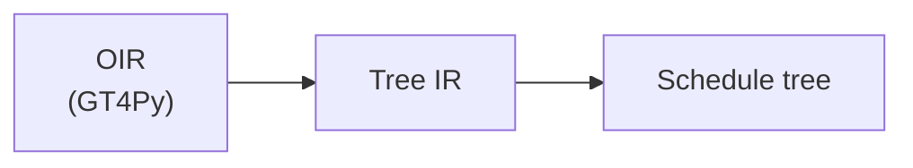

# Current state of schedule tree feature

This is a quick overview of the current state of the schedule tree feature. The feature requires two things

1. transpiling OIR to schedule trees
2. transpiling schedule trees to SDFGs

The first one is a GT4Py issue, the other a missing piece in DaCe.

## Workflow

## Working branches

- **GT4Py** [`romanc/oir-to-stree`](https://github.com/romanc/gt4py/tree/oir-to-stree) on [Roman's fork](https://github.com/romanc/dace)
- **DaCe** [`romanc/stree-to-sdfg`](https://github.com/romanc/dace/tree/romanc/stree-to-sdfg) on [Roman's fork](https://github.com/romanc/dace)

The DaCe branch branches off from `v1/maintenance` and includes Tal's work from the branch [`stree-to-sdfg`](https://github.com/spcl/dace/tree/stree-to-sdfg). For a quick overview of the changes, look at

<https://github.com/spcl/dace/compare/v1/maintenance...romanc:romanc/stree-to-sdfg>

## OIR to schedule tree

OIR to schedule tree goes via a "Tree IR". The tree IR is just here to facilitate building the schedule tree. For now, we don't do any transformation on the tree IR.

OIR to tree IR conversion has two visitors in separate files:

1. `oir_to_treeir` transpiles control flow
2. `oir_to_tasklet` transpiles computations (i.e. bodies of control flow elements) into tasklets

While this incurs a bit of code duplications (e.g. for resolving indices), allows for separation of concerns. Everything that is related to the schedule is handled in `oir_to_treeir`. Note, for example, that we keep the distinction between horizontal mask and general `if` statements. This distinction is kept because horizontal regions might influence scheduling decisions.

The conversion from tree IR to schedule tree is then a straight forward lowering.

## Schedule tree to SDFG

In big terms, schedule tree to SDFG conversion has the following steps:

1. Setup a new SDFG and initialize it's descriptor repository from the schedule tree.
2. Insert (artificial) state boundary nodes in the schedule tree:
    - Insert state boundary nodes before control flow nodes and state labels.
    - Insert memory dependency state boundaries (e.g. potential data races)
    - Insert a state boundary after inter-state assignment nodes[^1].
    - Insert state boundary before maps containing a nested SDFG[^2].
3. Visitor on the schedule tree, translating every node into the new SDFG, see class `StreeToSDFG`.
4. Memlet propagation through the newly crated SDFG.
5. Run `simplify()` on the newly created SDFG (optional).

### Hacks and shortcuts

- `StreeToSDFG` has many visitors raising a `NonImplementedError`. I've implemented these visitors on an as-needed basis.
- I've added additional state boundaries around nested SDFGs (needed for state changes, e.g. `IfScope`, inside `MapNodes`) to force correct execution order.
- I've added additional state boundaries after inter-state assigns to ensure the symbols are defined before they are accessed. As far as I understand, that shouldn't be necessary. However, I've had SDFGs (todo: which ones?) with unused assigns at the end of the main visitor.
- I've written tests for some things as a way of developing the main visitor. For simple schedule trees, I've already added checks on the resulting SDFG, but pretty fast I ended up validating by "looking at the resulting SDFG".

## Optimization laundry list

Things we want to do for optimization (and things we have to re-build from the old bridge).

- Different loops per target hardware: like [previously](https://github.com/GridTools/gt4py/blob/a2687f9126d1d27e7caaebf629f9e41035766bb5/src/gt4py/cartesian/backend/dace_backend.py#L75-L120), but less confusing
- Tiling: like [previously](https://github.com/GridTools/gt4py/blob/a2687f9126d1d27e7caaebf629f9e41035766bb5/src/gt4py/cartesian/backend/dace_backend.py#L123-L132), but hardware dependent. More details in [this file](https://github.com/GridTools/gt4py/blob/a2687f9126d1d27e7caaebf629f9e41035766bb5/src/gt4py/cartesian/gtc/dace/expansion_specification.py#L237-L240).
- CPU: temps are allocated & de-allocated on the fly
- Axis-split merge
- Over-computation merge
- Local caching
- Inline thread-local transients: like [previously](https://github.com/GridTools/gt4py/blob/a2687f9126d1d27e7caaebf629f9e41035766bb5/src/gt4py/cartesian/gtc/dace/transformations.py#L36).
- Optimize OpenMP pragmas: Check which of the [previous optimizations](https://github.com/GridTools/gt4py/blob/a2687f9126d1d27e7caaebf629f9e41035766bb5/src/gt4py/cartesian/backend/dace_backend.py#L162-L182) still make sense.
- We ran a [special version](https://github.com/GridTools/gt4py/blob/a2687f9126d1d27e7caaebf629f9e41035766bb5/src/gt4py/cartesian/gtc/dace/transformations.py#L15-L33) of `TrivialMapElimination` with more condition to when it applies.
- Special cases for stencils without effect? They were treated separately in [the previous bridge](https://github.com/GridTools/gt4py/blob/a2687f9126d1d27e7caaebf629f9e41035766bb5/src/gt4py/cartesian/backend/dace_backend.py#L148-L152).
- In the previous bridge, we'd [merge a horizontal region with the loop bounds](https://github.com/GridTools/gt4py/blob/a2687f9126d1d27e7caaebf629f9e41035766bb5/src/gt4py/cartesian/gtc/dace/expansion/daceir_builder.py#L1042-L1053) in case the horizontal region was the only thing inside that loop.
- In the previous bridge, we'd [split horizontal execution regions](https://github.com/GridTools/gt4py/blob/a2687f9126d1d27e7caaebf629f9e41035766bb5/src/gt4py/cartesian/gtc/dace/expansion/expansion.py#L149). This was also used for [orchestration in NDSL](https://github.com/NOAA-GFDL/NDSL/blob/2986b450386b5006d847f246ff6e8b23abdc9190/ndsl/dsl/dace/sdfg_opt_passes.py). To be re-evaluated.

[^1]: as far as I understand `_insert_memory_dependency_state_boundaries`, this shouldn't be necessary. Might be related to extra state boundaries for nested SDFGs.
[^2]: Nested SDFGs are added when multiple states are needed inside a map.
